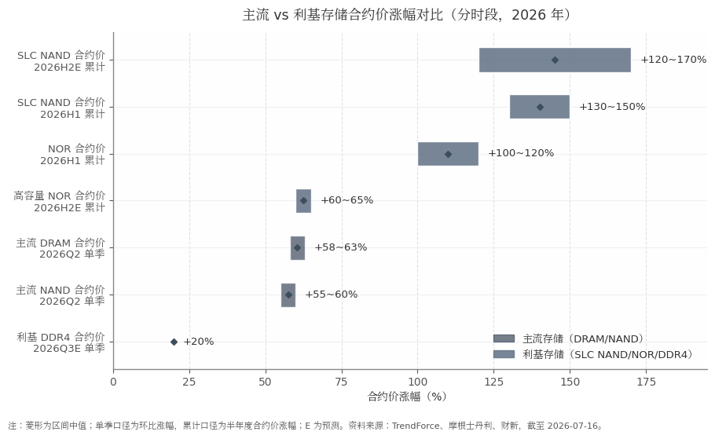

## 2. 行业分析：存储涨价周期的位置与持续性

抄底时点的成立与否，首先取决于行业前提：本轮存储涨价从何而来、行至何处、还能持续多久。本章的结论是：本轮周期的本质并非传统的库存周期往复，而是 AI 需求对全球存储产能的结构性挤出，利基存储因供给收缩不可逆而呈现显著强于主流 DRAM/NAND 的涨价弹性；机构共识为上行至少延续至 2027 年中至下半年，但 2026Q3 起涨幅收窄、终端需求走弱与板块高估值构成三大分歧点。7 月 16 日的板块回调属全球资金与情绪共振，而非涨价逻辑的证伪——这一性质判定直接决定了"抄底"讨论的有效性边界。

### 2.1 本轮周期的驱动结构

#### 2.1.1 AI 需求挤出效应：HBM/DDR5 抢占产能，三星停 2D NAND、美光退 DDR4，利基供给收缩不可逆

本轮涨价的第一驱动力是 AI 服务器对存储用量的量级式抬升：单台 AI 服务器的 DRAM 用量为传统服务器的 8 至 10 倍、NAND 用量为 3 倍以上，三星、SK 海力士、美光三大原厂已将 70% 以上先进晶圆产能转产 HBM 与服务器 DDR5，主动压缩通用消费级颗粒供给，2026 年上半年 DRAM 累计涨幅超 340%、NAND 超 320%[^1^]。挤出的量化程度可观：2026 年 HBM 投片已占全球 DRAM 晶圆总产能约 12% 至 15%，数据中心与 AI 服务器合计消耗全球约一半的 DRAM 产能[^2^]。WSTS（世界半导体贸易统计组织）据此预测 2026 年全球存储芯片市场规模同比增长 249.5% 至约 8039 亿美元[^3^]。

对利基存储而言，供给收缩带有更强的不可逆性。三星自 2024Q2 起停止 DDR3 生产并持续削减 DDR4；美光 2025 年中宣布 6 至 9 个月内停供 DDR4/LPDDR4，并于 2026Q1 彻底终止 DDR4 发货；三星 2025Q1 宣布永久关停 2D NAND 产线，铠侠 2025 年 9 月起停止 SLC/MLC 新订单[^4^]。退出的经济学逻辑在于利基存储的晶圆投入产出比仅为 HBM 的约五分之一，且 8 英寸产线改造与设备备件均难以逆转，属于永久性供给重构而非产能的周期性腾挪[^5^]。这意味着即便未来价格回落，利基品类的供给也难以恢复到本轮周期之前的水平，这是本轮周期区别于 2017—2018 年、2021 年两轮涨价的关键结构差异。

#### 2.1.2 价格数据：主流合约价单季涨约六成，利基品类半年度涨幅翻倍以上

TrendForce 数据显示，2026Q2 主流 DRAM 合约价环比上涨 58% 至 63%、NAND 上涨 55% 至 60%[^6^]；利基品类涨幅更陡，2026 上半年 SLC NAND 合约价累计上涨 130% 至 150%、NOR Flash 上涨 100% 至 120%，且 7 月调查将 SLC NAND 下半年涨幅预估由 6 月的 70% 至 75% 大幅上修至 120% 至 170%，"不排除有上修空间"[^7^][^8^]。

**表 2-1 2026 年存储合约价涨幅：主流品类 vs 利基品类（分时段）**

| 品类 | 时段口径 | 涨幅 | 数据来源 |
|---|---|---|---|
| 主流 DRAM 合约价 | 2026Q2 单季环比 | +58~63% [^6^] | TrendForce（财新转引） |
| 主流 NAND 合约价 | 2026Q2 单季环比 | +55~60% [^6^] | TrendForce（财新转引） |
| NOR Flash 合约价 | 2026H1 累计 | +100~120% [^7^] | TrendForce |
| 高容量 NOR 合约价 | 2026H2E 累计 | +60~65% [^7^] | TrendForce |
| SLC NAND 合约价 | 2026H1 累计 | +130~150% [^7^] | TrendForce |
| SLC NAND 合约价 | 2026H2E 累计 | +120~170% [^8^] | TrendForce 7 月调查 |
| 利基 DDR4 合约价 | 2026Q3E 单季环比 | 约 +20% [^9^] | 摩根士丹利 |
| DRAM（财新累计口径） | 2026H1 累计 | 超 +340% [^1^] | 财新数据 |
| NAND（财新累计口径） | 2026H1 累计 | 超 +320% [^1^] | 财新数据 |

注：财新累计口径含现货与合约价格的综合涨幅，与 TrendForce 合约价口径不可直接相加比较。

从表中可以读出三层含义。其一，涨价弹性排序为 SLC NAND＞NOR＞主流 DRAM/NAND，利基品类的斜率约为主流品类的两倍以上，这直接解释了以 SLC NAND 为主力产品的东芯股份一季度的业绩弹性。其二，SLC NAND 下半年预估在一个月内由 +70~75% 上修至 +120~170%，上修的驱动是 MLC 供给极度短缺迫使工控、车用、网通客户转单 SLC，叠加 AI 边缘运算需求[^8^]，说明涨价正在沿"主流→利基→利基内部品类轮动"的路径传导，而非单点脉冲。其三，涨价已从现货市场进入订单与报表层面：聚辰半导体 7 月 6 日起对全系列 NOR 提价 25%，部分下游客户从 DDR4 切回 DDR3 形成回流需求[^10^]；产业侧华邦 2026 及 2027 年产能已全数售罄[^11^]。需要提示的是，弗若斯特沙利文估计 2025 年全球专用型存储市场规模仅约 157 亿美元（利基 DRAM 99 亿、NOR 31 亿、SLC NAND 27 亿），属"小而美"赛道，价格弹性大但绝对容量有限[^12^]。

**图 2-1 主流 vs 利基存储合约价涨幅对比（分时段，2026 年）**

图 2-1 直观呈现了涨幅的分层结构：主流 DRAM/NAND 单季涨幅约 55% 至 63%，而利基 SLC NAND 两个半年度累计涨幅均在 120% 以上；即便考虑口径差异（单季环比与半年度累计不可直接比较），利基品类的涨价强度与持续性预期均系统性高于主流品类。摩根士丹利预计利基 DDR4 2026Q3 单季环比再涨约 20%，是图表中唯一涨幅温和的数据点，反映利基 DRAM 的供给收缩烈度弱于 NAND/NOR[^9^]。

### 2.2 周期位置判断

#### 2.2.1 机构共识：上行持续至 2027H2 前后，利基景气长尾或至 2028

主流机构对周期顶部的判断高度集中于 2027 年。TrendForce 预计服务器 DRAM 合约价上行将持续至 2027H2（涨幅逐步收敛），依据是 2027 年服务器 RDIMM 供给按容量计仅增长 15% 至 20%，远落后于 CPU 出货增速[^13^]；华泰证券梳理的市场一致预期为 DRAM 平均售价（ASP）增长至少延续至 2027Q3、NAND ASP 至少延续至 2027Q2[^14^]；IDC 预计内存供应紧张贯穿 2026 年并持续至 2027 年年中，预测期内价格几乎无望回落至 2025 年水平[^15^]。利基品类的景气长尾更长：摩根士丹利测算 DDR4 在 2026H2 的供需缺口为 19% 至 20%，2027 至 2028 年缺口仍维持 18% 至 20%[^9^]。

与共识并存的是产业链内部的第一声警报。兆易创新在 6 月 18 日公告中自警"存储行业历史上呈现显著周期性波动，供给与需求终将走向再平衡"，预计 2027 年后随利基 DRAM 产能边际增加，价格可能进入高位震荡[^16^]。这一表述的含义在于：即便是本轮周期最大的受益者之一，也已在公开文件中为 2027 年后的价格回落预设叙事。综合而言，共识与自警可以统一为一句话——本轮上行大概率延续至 2027 年中至下半年，但 2027 年是价格由"上行"切换为"高位震荡或回落"的高风险窗口。

#### 2.2.2 分歧点：涨幅收窄的性质、终端需求隐忧与模组厂库存红利耗尽

当前市场的分歧不在于"涨不涨"，而在于"以什么斜率涨到何时"。第一个分歧点是 2026Q3 涨幅收窄的性质：TrendForce 明确指出，Q3 涨幅收敛的主因是买方支付意愿下降——存储价格已高到 PC、手机与消费类厂商无法全部接受，市场正"缓慢接近痛苦阈值"，而非供给改善[^17^]。乐观方据此认为收窄仅是高价抑制需求的降温信号；谨慎方则认为买方抵制正是每一轮周期见顶前的标准前兆，两种解读目前均无证伪对方的证据。

第二个分歧点是终端需求的破坏已经发生。2026Q2 全球智能手机出货 2.775 亿部、同比下降 6.7%，三家调研机构一致将主因归于存储短缺与成本抬升；IDC 预计 2026 全年手机出货下降 12.9%，为十余年最低[^18^][^15^]。对利基存储而言，手机与消费类恰是 NOR 与中小容量 NAND 的基本盘，需求的量减会否最终压过供给的收缩，是 2027 年景气假设的最大软肋。第三个分歧点是中游利润池的变化：模组厂的低价库存红利正在耗尽，德明利因 Q2 毛利率预期放缓遭遇两日跌停，财新报道确认"随着低价库存逐步消化及新采购成本上行，毛利率预期将逐步放缓"[^6^]——涨价红利正从渠道与模组环节向上游原厂与设计公司集中，这对东芯等 fabless 设计公司反而是相对有利的结构。此外，2027 年云厂商资本开支一致预期已小幅下修，申万宏源提示若 AI 利润兑现不及预期，上游基建将面临"严重的周期洗礼"[^14^]，构成共识之外的系统性尾部风险。

### 2.3 资本市场映射

#### 2.3.1 长鑫科技 IPO 与长江存储拟上市：板块估值体系的重塑

本轮周期在资本市场最重要的映射事件是国产存储龙头的集中证券化。长鑫科技 7 月 14 日以 8.66 元/股定价、7 月 16 日申购，预计募资约 579 亿元（绿鞋全额行使后达 666 亿元），发行市值约 5792 亿元，创科创板开板以来第二大 IPO 纪录，对应发行市盈率约 278 倍；该市值明显低于市场此前 1 万亿至 3 万亿元的预期[^19^]。基本面支撑同样罕见：长鑫 2026Q1 营收 508 亿元、同比增长 719%，归母净利润 247.62 亿元[^20^]。长江存储母公司长存集团已于 2026 年 5 月 19 日完成 IPO 辅导备案，市场预期发行估值约 2000 亿至 3000 亿元，最快于 2026Q4 至 2027H1 上市[^21^]。

两存上市对板块估值体系的重塑体现在两个方向。正向看，龙头以高盈利、高增速登陆公开市场，为整个板块提供了可交易的估值锚：财新引 iFinD 数据显示 A 股存储芯片行业 2026 年预测市盈率中枢为 55.2 至 59.8 倍[^22^]；国泰海通进一步指出，长协锁单使周期波动边际收敛，板块估值逻辑正从周期性博弈转向基于盈利确定性的重新定价[^23^]。反向看，"周期股在顶部附近巨型 IPO"的历史经验令部分资金警觉，5792 亿元的发行市值较预期折半本身即被解读为发行方对周期位置的谨慎定价，且长鑫挂牌后的资金分流与"资金向龙头集中、中小存储概念股估值回调"的压力已在卖方提示之列[^24^]。

#### 2.3.2 A 股存储板块 2026 年表现与 7/16 全球共振回调的性质判定

2026 年以来 A 股存储板块经历了剧烈的重估与回撤。7 月 16 日板块全线重挫，存储芯片板块指数一度下跌 5%，澜起科技收跌 17.2% 领跌[^25^]，主要个股表现如下表所示。

**表 2-2 A 股存储板块主要个股 7/16 表现与 2026 年以来涨幅（7/16 收盘）**

| 公司 | 代码 | 7/16 涨跌幅 | 2026 YTD | 总市值（亿元） | 2026E PE（倍） |
|---|---|---|---|---|---|
| 普冉股份 | 688766.SH | -9.00% [^26^] | +313.5% [^26^] | 782 | 72.8 |
| 德明利 | 001309.SZ | -10.00%（跌停）[^6^] | +157.1% [^26^] | 1,352 | 16.8 |
| 兆易创新 | 603986.SH | -10.00%（跌停）[^6^] | +140.2% [^26^] | 3,611 | 72.2 |
| 江波龙 | 301308.SZ | -5.00% [^6^] | +89.3% [^26^] | 1,961 | 14.3 |
| 北京君正 | 300223.SZ | -8.19% [^26^] | +64.7% [^26^] | 844 | 71.2 |
| 恒烁股份 | 688416.SH | -10.60% [^26^] | +59.9% [^26^] | 95 | 48.3 |
| 聚辰股份 | 688123.SH | -8.67% [^26^] | +26.1% [^26^] | 252 | 49.3 |
| 东芯股份 | 688110.SH | -7.35% [^6^] | +3.9% [^26^] | 604 | 98.8 |
| 复旦微电 | 688385.SH | -3.80% [^26^] | -20.3% [^26^] | 484 | 54.1 |

注：YTD 为未复权口径；2026E PE 按 7/16 收盘市值除以 iFinD 一致预期 2026 年归母净利润计算。

对 7/16 回调的性质判定为"全球共振下的资金行为"，依据有三。其一，触发因素均来自外部与情绪面：前一交易日美光、西部数据跌超 8% 形成全球映射，德明利两日跌停引爆板块情绪，叠加长鑫科技当日申购分流约 579 亿元资金，当日并无任何关于合约价转跌或需求崩塌的新增产业证据[^6^][^25^]。其二，下跌的内部结构验证了"涨得多、跌得重"的获利了结逻辑：年内涨幅最大的普冉（+313.5%）、德明利（+157.1%）、兆易（+140.2%）跌幅居前，而 YTD 仅 +3.9% 的东芯与 -20.3% 的复旦微电跌幅相对温和，说明抛售压力与前期涨幅高度相关，属筹码出清而非基本面重估[^26^]。其三，估值分层在回调中纹丝未动：设计公司 2026E PE 仍在 48 至 99 倍区间，模组厂仅 14 至 17 倍，市场按"强周期顶部盈利"为模组厂定价、按"涨价持续性"为设计公司定价的框架没有因单日暴跌而改变[^26^]。

综合本章，行业层面对抄底决策给出的前提是：周期未走完（共识指向 2027H2 前后见顶，利基景气或延续至 2028），利基强于主流的涨价结构仍在强化，但涨幅收窄、手机需求走弱与高位拥挤的筹码意味着 2026 下半年起板块波动率将系统性放大。对东芯而言，行业贝塔依然向上，但"涨价持续"的验证窗口将落在 Q3/Q4 合约价谈判与公司 8 月 22 日半年报——这一传导机制的具体路径，将在第 3 章展开。
