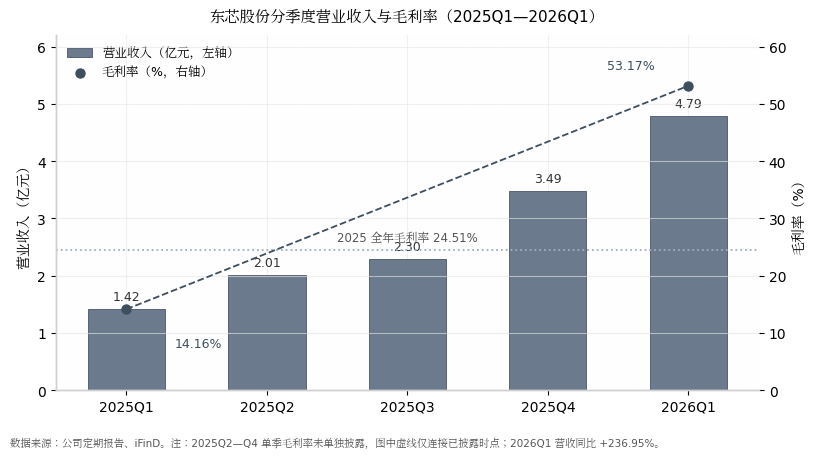

## 4. 公司基本面与财务拐点

本章回答抄底决策的三个前提问题：基本面拐点是否真实、业绩质量如何、财务是否安全。核心结论是：东芯的拐点已由 2026 年一季报确认——单季营收 4.79 亿元（同比 +236.95%）、毛利率 53.17%、归母净利润 +1.38 亿元、经营性现金流较上年同期转正[^1^]；2025 年报表亏损的主因并非存储主业恶化，而是高研发投入与砺算权益法亏损的会计叠加[^2^]；资产负债表几乎无杠杆，类现金储备约占总资产一半[^3^]。真正需要持续验证的，是 53% 毛利率能维持多久。

### 4.1 财务拐点验证

#### 4.1.1 2025 年报：亏损源于研发 2.16 亿与砺算权益法亏损 1.66 亿

2025 年公司实现营业收入 9.21 亿元，同比 +43.76%；毛利率 24.51%，同比提升 10.52 个百分点；但归母净利润为 -1.95 亿元，亏损同比扩大 16.54%[^2^][^3^]。收入高增与亏损扩大并存，关键在于拆解亏损构成：当年研发费用 2.16 亿元（占营收 23.43%），对联营企业上海砺算按权益法确认投资亏损 1.66 亿元，两项合计 3.82 亿元，已超过 2.26 亿元的毛利额[^2^][^3^]。

**表 4-1 东芯股份 2023—2025 年关键财务指标**

| 指标 | 2023A | 2024A | 2025A |
|---|---|---|---|
| 营业收入（亿元） | 5.31 | 6.41 | 9.21 [^2^] |
| 营收同比 | — | +20.8% | +43.76% [^3^] |
| 毛利率 | 11.89% | 13.99% | 24.51% [^2^] |
| 研发费用（亿元） | 1.82 | 2.13 | 2.16 [^3^] |
| 联营企业投资损益（亿元） | — | -0.16 | -1.66 [^2^] |
| 归母净利润（亿元） | -3.06 | -1.67 | -1.95 [^2^] |
| 基本每股收益（元） | -0.69 | -0.38 | -0.45 [^3^] |
| 经营活动现金流净额（亿元） | — | -2.78 | -1.58 [^3^] |
| 期末存货（亿元） | — | 8.92 | 10.66 [^3^] |

三年维度看，公司收入连续加速（+20.8% → +43.8%），毛利率自 11.89% 修复至 24.51%，年均抬升约 6.3 个百分点，存储主业的修复趋势明确。亏损在 2024 年收窄后于 2025 年重新扩大，并非毛利率恶化所致，而是砺算权益法亏损从 0.16 亿元放大至 1.66 亿元、研发维持 2 亿元以上高位共同压制的结果。换言之，报表利润拐点被战略投入"延迟"了一年；经营性现金流缺口从 -2.78 亿元收窄至 -1.58 亿元，同样印证主业造血能力在改善，存货持续攀升则反映公司在涨价周期中主动备货。

**表 4-2 2025 年归母净利润亏损拆解（单位：亿元）**

| 项目 | 金额 | 说明 |
|---|---|---|
| 毛利 | +2.26 | 营收 9.21 亿 × 毛利率 24.51% [^2^] |
| 研发费用 | -2.16 | 占营收 23.43% [^3^] |
| 管理/销售/财务费用 | -1.26 | 分别为 0.89 / 0.28 / 0.09 亿 [^3^] |
| 资产减值损失 | -0.33 | 以存货跌价准备为主 [^3^] |
| 投资收益 | -1.47 | 其中砺算权益法亏损 -1.66 亿 [^2^] |
| 其他收益等轧差项 | +0.80 | 含政府补助、公允价值变动等（测算值） |
| 净利润 | -2.16 | 含少数股东损益 -0.21 亿 [^2^] |
| **归母净利润** | **-1.95** | 亏损同比扩大 16.54% [^3^] |

拆解显示，2025 年亏损的两个最大来源——研发投入 2.16 亿元与砺算权益法亏损 1.66 亿元——均属"存算联"战略投入，而非存储主业的经营性亏损。粗略测算，若加回砺算亏损 1.66 亿元及 Wi-Fi 7 运营主体亿芯通感 0.72 亿元的净亏损[^2^]，存储主业 2025 年已接近盈亏平衡。这意味着一旦主业毛利率上行、或战略投入减亏，利润弹性将集中释放——2026 年一季报正是这一机制的首次兑现，也解释了为何亏损的"质"与周期底部的经营性亏损（如 2023 年）有本质区别。

#### 4.1.2 2026Q1 拐点：营收 +237%、毛利率 53.17%、现金流转正

2026Q1 公司实现营收 4.79 亿元，同比 +236.95%，单季收入已达 2025 年全年的 52%；毛利率 53.17%，同比抬升约 39 个百分点（2025Q1 为 14.16%）；归母净利润 +1.38 亿元（上年同期 -0.59 亿元），其中扣非归母 +1.32 亿元，非经常性损益仅约 0.06 亿元，利润含金量较高；经营活动现金流净额 +0.41 亿元，较上年同期 -0.54 亿元转正，加权 ROE 3.91%[^1^]。盈利质量上，扭亏并非依赖费用压缩：研发费用绝对额仅同比 -4.73% 至 0.53 亿元，主要是收入规模摊薄使研发费用率从 39.33% 降至 11.12%[^1^]。管理层将改善归因于半导体景气回升、中小容量存储结构性紧缺下的产品量价齐升[^4^]。

存货维度，2026Q1 末存货 11.93 亿元，较 2025 年末再增 12%，约占总资产 30%[^1^]。在 SLC NAND 2026H1 合约价累计上涨 130%–150% 的价格环境下[^5^]，前期低成本备货意味着 Q2—Q3 确认收入时仍可享受"低价库存红利"，为高毛利率的持续性提供成本端支撑；但高存货在周期反转时也将对称放大跌价风险，属于典型的周期股双刃属性，需与 8 月半年报的存货去化节奏对照验证。

### 4.2 收入结构与增长质量

#### 4.2.1 分产品：NAND 占 65%，1xnm SLC NAND 量产的意义

2025 年收入结构为：NAND 6.01 亿元（占 65.2%，同比 +64.21%，毛利率 27.26%）；MCP 2.31 亿元（25.0%，+39.14%，11.46%）；利基 DRAM 0.54 亿元（5.8%，-19.51%，33.00%）；NOR 0.33 亿元（3.6%，-15.64%，46.82%）[^2^]。这一结构有三层含义：其一，占比近三分之二的 SLC NAND 恰是本轮涨价弹性最大的品类（2026H1 合约价 +130%–150%[^5^]，TrendForce 预计 2026Q2—Q4 仍有约 120% 上涨空间[^6^]），东芯收入结构与涨价品类的匹配度在利基存储公司中最高，构成其业绩弹性大于同业的产品基础；其二，NOR 虽是毛利率最高的品类（46.82%），但占比仅约 4% 且 2025 年仍负增长，AI 端侧（智能耳机/眼镜）逻辑对东芯短期业绩贡献有限；其三，利基 DRAM 体量小且收入下滑，在 DDR4 涨价潮中东芯的受益弹性弱于兆易创新等以 DRAM 为主的对手。

供给能力上，1xnm SLC NAND 已于 2025 年实现量产，制程从 2xnm 推进至 1xnm，缩小了与华邦、旺宏、兆易（24nm 级）的单位成本差距，并支撑 4Gb/8Gb 大容量产品与车规客户导入，是公司承接涨价、维持高毛利的成本基础[^7^]。增长质量的瑕疵在于客户集中：2025 年前五大客户销售额占比 66.17%，第一大客户占 23.00%[^2^]，上行期大客户放量推高弹性，下行期砍单的业绩波动也将被对称放大。

#### 4.2.2 分季度趋势：收入逐季爬坡、毛利率跳升

2025 年分季度营收分别为 Q1 1.42 亿、Q2 2.01 亿、Q3 2.30 亿、Q4 3.49 亿元，Q2—Q4 环比增速为 +41.1%、+14.3%、+52.0%；2026Q1 进一步环比 +37.4% 至 4.79 亿元[^2^][^1^]。收入逐季加速与毛利率跳升（2025Q1 14.16% → 2026Q1 53.17%）同步出现，符合"量价齐升"特征，而非以价换量式的补库行情；2025Q4 单季收入已相当于 2024 年全年的 54%，说明涨价向报表的传导自 2025 年下半年起持续强化。需要提示的是，2025Q2—Q4 单季毛利率未单独披露，全年 24.51% 与 2026Q1 53.17% 之间缺少中间锚点，Q2 毛利率能否站稳 50% 上方，需待 8 月 22 日半年报验证。

### 4.3 资产负债表与"存算联"投入

#### 4.3.1 资产负债率仅 5.7%：财务安全垫评估

截至 2025 年末，公司总资产 38.40 亿元、总负债 2.18 亿元，资产负债率仅约 5.7%，几乎无有息负债；货币资金 5.97 亿元、交易性金融资产 5.35 亿元，另有以长期定存及理财为主的其他非流动资产 8.17 亿元，类现金储备合计约 19.5 亿元，约占总资产 51%；流动比率 14.25、速动比率 7.05，货币资金对短期债务覆盖约 44.7 倍[^3^]。2026Q1 末资产负债率 6.33%，仅新增短期借款 0.27 亿元[^1^]。需指出的是，公司未分配利润为 -4.92 亿元（累计亏损），2025 年度不分配不转增并以公积金弥补亏损[^2^]。综合评估：即便存储周期在 2027 年前后反转，公司也不存在偿债压力，财务安全垫足以支撑其穿越下行周期并维持每年 2 亿元以上的研发投入；财务层面的真实风险不在杠杆，而在存货跌价与砺算权益法亏损两处。

#### 4.3.2 砺算（35.87%）双刃剑：当期拖累与期权价值

东芯持有上海砺算 35.87% 股权，累计出资约 4.11 亿元，权益法核算、不并表[^8^]。拖累端：2025 年确认投资亏损 1.66 亿元，占当年归母亏损的 85%；2026Q1 仍确认约 0.21 亿元亏损，而长期股权投资余额反从 0.92 亿元增至 2.53 亿元（+175%），显示公司仍在加码 GPU 战略[^2^][^1^]。期权端：砺算 7G100（台积电 6nm、全自研架构）已于 2025 年 9 月启动量产、12 月完成首批订单交付，2026 年 3 月专业卡正式发售[^9^]；消费级 LX 7G100 零售版定价 2688 元，于 2026 年 7 月 17 日在京东开售，砺算并为国内唯一通过微软 WHQL 认证的国产独显厂商[^10^]。但预期需按公司公告口径打折：砺算与云计算厂商目前仅签署战略合作框架协议、尚未形成订单与收入，产品面向 PC、专业设计与数字孪生场景，而非大模型算力集群[^11^]；公司风险提示亦明确，全球独显约 98% 份额由英伟达与 AMD 主导，砺算存在产业化进度与单一产品依赖风险[^12^]。Wi-Fi 7 芯片则处于更早期：样片测试完成，项目预计总投资 2.6 亿元、累计投入 1.07 亿元（约 41%），2025 年零收入，运营主体亿芯通感当年净亏损 0.72 亿元[^2^]。总体看，"存算联"对 2026 年利润表仍是净拖累，其价值主要体现在砺算股权的重估期权，而非当期利润贡献。

### 4.4 机构盈利预测

#### 4.4.1 一致预期 2026E 净利 6.1 亿：预测上修与敏感性

iFinD 一致预期 2026 年归母净利润 6.115 亿元（同比 +413.9%）、营收 21.44 亿元（+132.6%），2027E、2028E 归母净利润分别为 6.26 亿、7.00 亿元[^13^]。华龙证券 2026 年 6 月 30 日首次覆盖给予"增持"评级，预测 2026—2028 年归母净利润 6.73 / 7.49 / 8.57 亿元，为目前卖方最高口径[^14^]。预测上修轨迹颇为陡峭：甬兴证券 2025 年 1 月尚预测 2025 年净利约 0.28 亿元、2026 年约 1.86 亿元[^15^]，实际 2025 年亏损 1.95 亿元，而当前 2026 年一致预期已升至 6.1—6.7 亿元——约一年内 2026E 预期上修逾 3 倍，本质是卖方对 SLC NAND 涨价幅度（2026H1 +130%–150%[^5^]）远超年初预期的追认，也意味着当前预期已部分内化了涨价周期的持续性。

敏感性方面，以一致预期 6.1 亿元测算，Q2—Q4 尚需实现约 4.7 亿元净利润，即单季约 1.57 亿元，较 2026Q1 的 1.38 亿元需环比再增约 14%；若按华龙证券 6.73 亿元口径，则单季需约 1.78 亿元。考虑到 TrendForce 预计 2026Q3 主流存储合约价涨幅收窄（NAND +10%–15%）[^16^]，一致预期能否兑现，取决于利基 SLC NAND 相对大宗品涨价的"超额斜率"能否维持；反之，若 Q4 合约价环比走平，当前一致预期存在系统性下修风险。

对抄底决策而言，本章的结论是：东芯的基本面拐点真实、财务安全垫厚实，业绩质量的分歧不在"是否扭亏"，而在"高毛利能维持几个季度"。下一个验证锚点是 8 月 22 日半年报中的 Q2 毛利率、存货去化与砺算亏损收窄节奏；而当前市值能否消化约 99 倍的 2026E 动态市盈率，留待第五章估值部分讨论。
