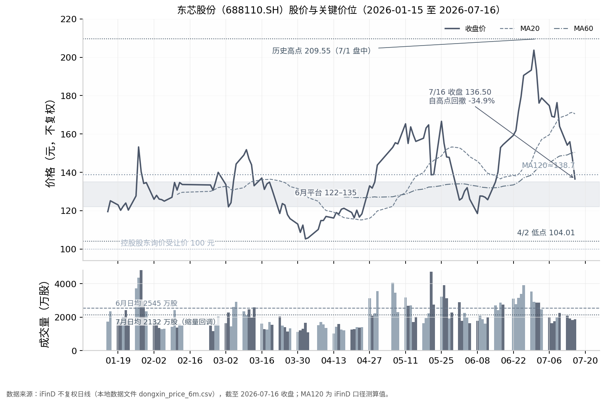

## 6. 资金面、筹码结构与技术位置

承接第 5 章"尚未便宜"的估值结论，本章从资金、筹码、技术三个维度回答：现在跌到什么位置、资金在干什么、什么信号才算"跌到位"。结论先行：**资金面（主力单边派发、杠杆未出清）与技术面（跌破全部均线）均不支持"立即抄底"**；对持有 138 元附近成本仓位的投资者，合理策略是"分批建仓＋信号触发"，而非一次性押注，具体方案与第 8 章衔接。

### 6.1 资金行为

#### 6.1.1 7 月主力单边净流出约 28 亿（7/1-7/16）、7/16 单日主力 -2.2 亿 vs 散户 +2.84 亿；融资余额 33.5 亿处 80% 分位未出清

7 月以来的资金行为呈现"主力派发、散户接盘、杠杆接刀"的顶部特征，抄底的资金面条件尚不具备。自 7/1 股价见顶以来，主力资金几乎单边净流出：已披露逐日流向的 6 个交易日（7/1、7/2、7/3、7/8、7/13、7/16）合计净流出约 28 亿元，其中 7/2 单日净流出 13.72 亿元、占当日成交额 26.2%，为阶段最大抛售日[^1^]；7/1 净流出 5.56 亿元[^2^]，7/3 净流出 2.68 亿元[^3^]，期间仅 7/8 小幅净流入 0.34 亿元[^4^]，7/13、7/16 再度分别净流出 4.17 亿元、2.2 亿元[^5^][^6^]。这与 6 月主升浪形成鲜明方向逆转——6/15 主力单日曾净流入 4.55 亿元[^7^]。

比总量更具指示意义的是结构。7/16 当日主力净流出 2.2 亿元（占成交额 8.27%）、游资净流出 0.64 亿元，而散户资金净流入 2.84 亿元[^6^]——下跌末段"主力与游资同步撤退、散户逆势承接"，是典型的派发结构，而非恐慌出清结构。

杠杆资金构成第二层隐患。截至 7/14，融资余额 33.53 亿元，占流通市值 4.86%，处近一年 80% 分位以上高位[^8^]；6 月主升浪期间自 28.37 亿元（6/8）升至 34.78 亿元峰值（6/29），股价回落后仍停留在 33 亿元上方，未明显出清[^8^][^9^]；且 7/16 之前 5 个交易日融资仍净流入 1.14 亿元[^6^]，杠杆资金逆势"接刀"与股价破位并存，构成潜在平仓抛压源。融券余额仅约 1547 万元，主动做空可忽略[^9^]，抛压主要来自多头撤退。7 月暴跌期间个股未触发龙虎榜披露，游资动向不可见[^10^]；北向资金（香港中央结算）2026Q1 增持 318.00 万股至 642.49 万股（占流通股 1.45%）[^8^]，体量难以对冲境内主力流出。

**表 6-1 资金行为要点表（截至 2026-07-16）**

| 资金维度 | 最新数据 | 行为含义 |
|---|---|---|
| 主力资金（7/1–7/16） | 6 个披露日合计约 -28 亿元 [^1^][^2^][^6^] | 单边净流出，派发特征明确 |
| 7/16 单日结构 | 主力 -2.2 亿、游资 -0.64 亿、散户 +2.84 亿 [^6^] | 主力游资撤退、散户接盘 |
| 融资余额 | 33.53 亿元（7/14），占流通市值 4.86%，处近一年 80% 分位以上 [^8^] | 杠杆高位未出清，存平仓抛压 |
| 融券余额 | 约 1547 万元（7/13） [^9^] | 空头规模可忽略，抛压源于多头撤退 |
| 龙虎榜 | 7 月暴跌期间无披露 [^10^] | 游资动向不可见，信息缺口 |
| 北向资金 | 2026Q1 增持 318 万股至 642.49 万股 [^8^] | 长线小幅增持，难对冲主力流出 |

上表的综合指向是：本轮下跌的资金性质是"获利盘系统性撤离＋散户与杠杆盘被动承接"，而非"恐慌盘一次性出清"。对照 6/15 主升浪中主力单日净流入 4.55 亿元时股价加速上行[^7^]，当前流向方向完全相反。在主力连续净流出、融资余额维持 80% 分位高位的组合下，左侧抄底者实际是在与派发中的主力和未出清的杠杆盘做对手盘，胜率与赔率均不占优；资金面转正的先决条件，是主力单日净额转正并持续、融资余额水位与分位双降。

### 6.2 筹码与股东结构

#### 6.2.1 股东户数 4.88 万户同比 +140%，筹码显著分散；控股股东 4 月询价转让 442 万股 @100 元（10/13 解禁）；大基金二期退出前十

筹码结构已实质性受损：股东户数一年内翻倍以上，筹码由集中走向显著分散。截至 2026-03-31，股东户数 4.88 万户（48,842 户），环比 +3.84%、同比 +139.75%；人均流通股 9054 股，环比 -3.70%[^8^][^11^]。股东户数在大涨阶段翻倍，通常对应筹码由机构与大户向散户分散，与 6 月以来的天量换手互为印证。前十大流通股东合计持股 43.25%，其中控股股东东方恒信 30.88%[^12^]。

供给端有两个尚未释放完毕的事件。其一，控股股东东方恒信 4 月以询价方式转让 442 万股（占总股本 1%），定价 100.00 元/股，由申万宏源证券（199 万股）、泽丰瑞熙私募（81 万股）、财通基金（74 万股）等 6 家机构受让，锁定至 2026-10-13 解禁[^13^][^14^]；以 7/16 收盘计受让机构浮盈约 36.5%，若届时股价仍显著高于其成本则存在兑现动力——10 月中旬是确定的供给释放窗口[^13^]。其二，国家集成电路产业投资基金二期（大基金二期）2024Q4 新进持有 329.7 万股（0.745%）[^15^]，而 2026-03-31 十大流通股东榜单（第十名门槛 0.45%）中已无其身影，iFinD 最新机构名单亦无[^12^]，推断其已于 2025 年大涨期间减持至门槛以下或退出（负面证据推断，置信度中等）——产业资本的退出方向与控股股东减持一致。

#### 6.2.2 ETF/基金持仓变化；近 1 月无新增减持公告

机构持仓以被动指数资金为主，主动定价的"压舱石"缺位。按 2026 年基金一季报，重仓东芯的公募基金共 36 家[^6^]；但 iFinD 汇总显示，47 家机构合计持股 41.32% 中，一般法人占 35.92%，基金仅占 3.34%（约 1475.9 万股），且前十大持仓基金清一色为指数 ETF[^11^]。2026Q1 嘉实上证科创板芯片 ETF 持 649.78 万股列第三大流通股东、当季减持 53.97 万股，科创 100ETF（588220）新进第十（198.22 万股），南方中证 1000ETF 退出前十[^8^]。ETF 持仓随指数申赎被动增减，难以在下跌中形成稳定承接——这解释了本轮回调为何缺乏机构买盘缓冲。

减持公告维度短期偏暖：2026-04-01 至 07-16 全部 117 条公告核查显示，期间无新增减持计划或进展公告[^16^]。但 5/22 董事会已审议通过发行 H 股并在香港联交所主板上市议案，细节未定，构成中期潜在摊薄[^17^]。

### 6.3 技术位置

#### 6.3.1 关键价位地图：历史高点 209.55（7/1 盘中）→ 回撤 -34.9%；6 月平台 122-135；MA120 约 138.7；4/2 低点 104.01；控股股东受让价 100 元

先确立价格坐标。7/1 盘中创上市以来新高 209.55 元（经 2021 年上市至今全部月线复核），6/30 最高收盘 203.70 元；至 7/16 收盘 136.50 元，自盘中高点回撤 -34.9%，7 月上半月跌幅 -29.4%[^18^]。年内另一极端坐标是 4/2 盘中低点 104.01 元，为近 6 个月最低[^18^]。

均线与量能显示趋势已转空但尚未恐慌。截至 7/16，MA5/MA10/MA20/MA30/MA60/MA120 分别为 151.6、162.6、170.5、157.4、150.4、138.7 元，收盘价已跌破全部常用均线，且恰在半年线 MA120（138.7 元）下方[^18^]。量能上，7 月日均成交 2132 万股较 6 月 2545 万股萎缩，属缩量回调；但 7/16 单日 1882 万股未见恐慌放大[^18^]——既无恐慌出清的爆量，也无衰竭后的地量，是"下跌中继"而非"底部确认"的量能形态。

对 138 元附近的持仓成本而言，这一位置的含义是双面的：现价浮亏约 1.1%，恰处 MA120 与 6 月平台上沿的技术敏感位——若该区域企稳，成本线附近即出现反弹减亏窗口；若放量失守，则持仓将面对向 125 元乃至更深位置的浮亏扩张。

**图 6-1 东芯股份股价与关键价位（2026-01-15 至 2026-07-16）**

#### 6.3.2 当前位置判定：跌破全部均线、位于 6 月平台上沿——技术上未企稳，需等待缩量/资金回流信号（表格：关键价位与含义）

综合均线、量能与资金结构，当前技术位置判定为**"未企稳"**：股价跌破全部常用均线后，正落在 6 月上旬平台（122–135 元）的上沿，这里是"下跌后的第一个潜在支撑区"，而非"已确认的底部"。

**表 6-2 关键价位地图：价位、性质与含义**

| 价位（元） | 性质 | 含义 |
|---|---|---|
| 209.55 | 历史最高价（2026-07-01 盘中） [^18^] | 顶部与回撤基准，反弹长期压力 |
| 147–156 | 7 月中旬平台＋跳空区 | 反弹第一压力带 |
| 138.7 | MA120（半年线） [^18^] | 趋势分界参考；138 元成本仓位的敏感位 |
| 135.10 | 7/16 盘中低点 [^18^] | 最近支撑，失守则看 125 一线 |
| 122–135 | 6 月上旬平台 [^18^] | 主升浪启动区，多空分水岭 |
| 116.74 | 6/8 低点 [^18^] | 平台下沿失守后的次级支撑 |
| 104.01 | 4/2 盘中低点（近 6 个月最低） [^18^] | 年内极端回撤目标位 |
| 100.00 | 控股股东询价受让价 [^13^][^14^] | 产业资本定价锚；10/13 解禁股成本线 |

从上表可见，135–139 元是多重技术意义的交汇区：6 月平台上沿、MA120、7/16 低点与存量持仓成本密集区叠加，短期多空争夺将围绕该区域展开；下方 122–135 元平台是本轮主升浪的真实启动区，若回踩缩量企稳则具备中期支撑有效性。100–104 元一线兼具"4 月低点＋控股股东受让价"双重锚定，产业资本在该价位的真实成交行为，使其成为极端情形下的估值底参考，而非短期必达目标。

据此，"跌到位"应被定义为一组可观察信号而非某个具体价位：其一，**量能信号**——日成交萎缩至 1500 万股下方后地量企稳，或恐慌爆量后快速收复；其二，**资金信号**——主力资金单日转正并连续净流入、融资余额回落至 30 亿元下方（分位降至中性）；其三，**价格信号**——收复并站稳 MA120（138.7 元），或回踩 125 元一线缩量不破。反之，若放量跌破 122 元平台下沿，则下看 116.74 元（6/8 低点）乃至 104–108 元区间（4 月低点）。

本章结论与第 5 章估值结论方向一致：抄底的安全边际不来自价位本身，而来自筹码出清与资金回流的确认。对持有 138 元成本仓位的投资者，当前浮亏有限，无需恐慌离场，也缺乏一次性补仓摊低成本的依据；合理的动作是把 135/125/122 元转化为分批操作的触发器，等待三类信号逐一验证，并结合第 7 章催化剂日历（8/22 半年报、10/13 解禁窗口）安排节奏，具体方案见第 8 章。
